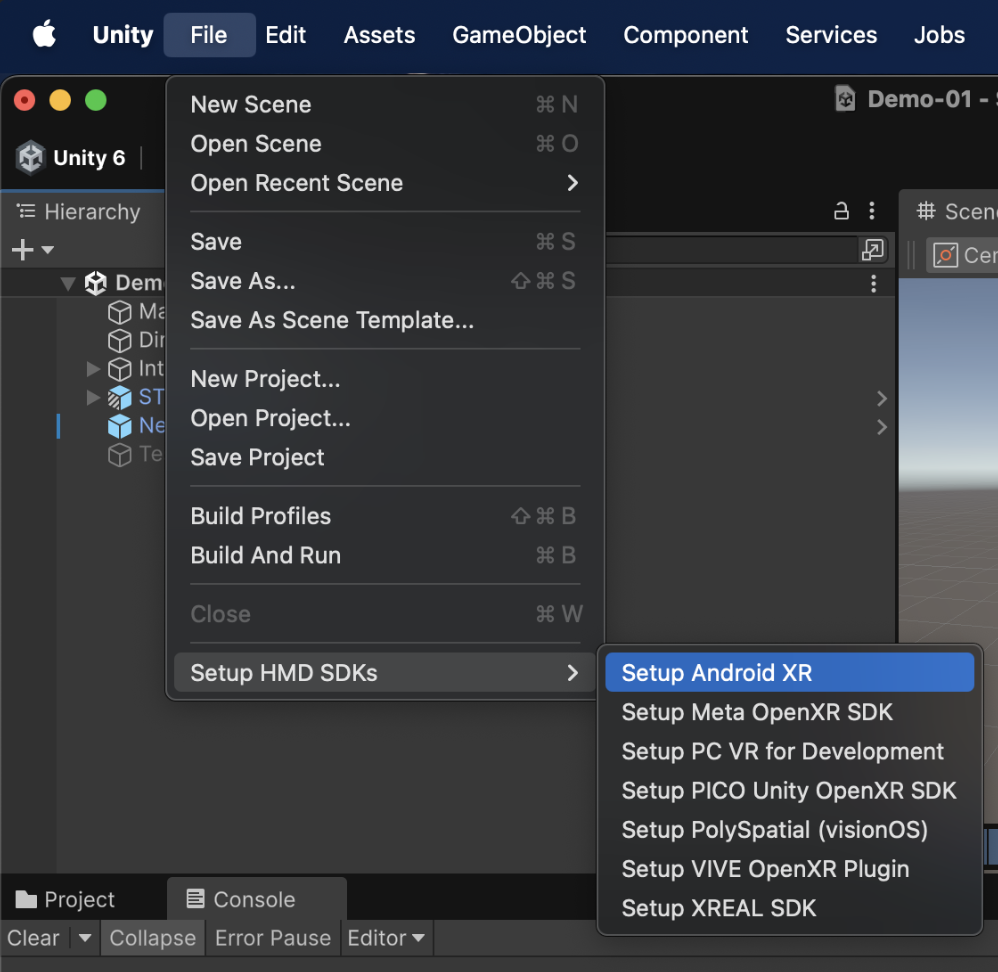
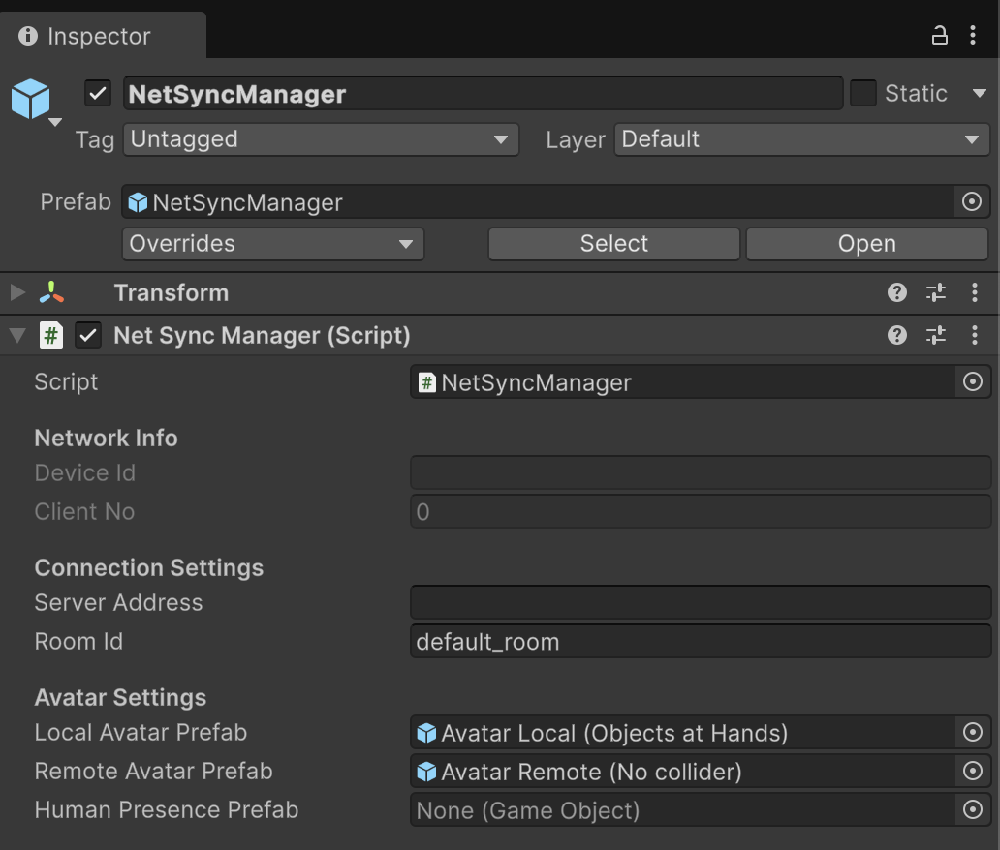

# STYLY-NetSync

[](https://github.com/styly-dev/STYLY-NetSync/releases)
[](https://unity.com/releases/unity-6)
[](https://opensource.org/licenses/Apache-2.0)
[](https://deepwiki.com/styly-dev/STYLY-NetSync)


## Overview

A minimal, high-performance networking package for Unity — built specifically for location-based entertainment (LBE) experiences.
STYLY NetSync includes an easy-to-integrate Unity package and a lightweight Python server to make real-time, synchronized XR sessions easy to build and deploy in venue networks.

**Highlights**

- **Super easy to use** — simple API and drop-in package so you can integrate fast and get running with minimal setup.
- **Super lightweight** — low CPU / memory footprint; optimized network traffic for stable performance on local networks.
- **Optimized for LBE** — syncs virtual and physical transforms and offers Human Presence (collision avoidance).

## Features

### Main features
- Avatar Transform Synchronization (1-120Hz adaptive broadcasting)
- RPC (Remote Procedure Call)
- Network Variable (synchronized key-value storage)

### Other features
- One-click SDK setup for HMDs
- Multifunctional XR Rig
- Battery level management
- Device ID mapping
- Automatic server discovery (UDP)
- Binary protocol (~60% bandwidth reduction)

Some features are provided via dependent package STYLY XR Rig.

## Installation

### Prerequisites

**uv/uvx**: Required to start the server.
**OpenUPM**: Required only when you add the package to your Unity project.

```shell
# Windows
winget install -e --id OpenJS.NodeJS.LTS
winget install --id=astral-sh.uv  -e
npm install -g openupm-cli

# Mac
brew install node
brew install uv
npm install -g openupm-cli
```

### Add STYLY-NetSync to Unity project

```shell
# Go to your unity project directory
cd YOUR_UNITY_PROJECT_DIR

# Add NetSync package with specific version
openupm add -f com.styly.styly-netsync@0.6.1
```

## Setup

### Start NetSync server

```shell
# Start NetSync server
# Use the same version as the Unity package
uvx styly-netsync-server@0.6.1

# [Optional] Start client simulator for testing
uvx --from styly-netsync-server@0.6.1 styly-netsync-simulator --clients 50
```
The uvx command automatically downloads the package, creates an isolated virtual environment, installs dependencies, and runs the python server program.

### Setup Unity scene

| SDK setup for HMDs | STYLY XR Rig |
|---|---|
| <br>Downloads and installs SDK, and sets up configurations. See more [details](https://github.com/styly-dev/STYLY-XR-Rig/blob/develop/Packages/com.styly.styly-xr-rig/Editor/SetupSDK/README.md). | <br>Supports most of samples in XR Interaction Toolkit, MR mode of HMDs, WASD control in Unity Editor mode and stick locomotion with HMD controllers.  |

#### NetSync Manager

<table>
  <thead>
    <tr>
      <th align="left">Inspector</th>
      <th align="left">Description</th>
    </tr>
  </thead>
  <tbody>
    <tr>
      <td align="left" valign="top">
        
      </td>
      <td align="left" valign="top">

**Properties**
- _deviceId - Displays the unique device ID assigned to this client.
- _clientNo - Shows the numeric client number assigned by the server.
- _serverAddress - Server IP or hostname; leave empty to auto-discover on the local network.
- _roomId - Identifier of the current room to join.
- _localAvatarPrefab - Prefab used for the local user's avatar.
- _remoteAvatarPrefab - Prefab used for remote users'avatars.
- _humanPresencePrefab - Prefab shown at each remote user's physical position (used for "human presence" visualization).
      </td>
    </tr>
    <tr>
      <td align="left" valign="top">
        
      </td>
      <td align="left" valign="top">

**Events**
- OnAvatarConnected - Triggered when a remote avatar connects to the network, passing the client number as an argument.
- OnAvatarDisconnected - Triggered when a remote avatar disconnects from the network, passing the client number as an argument.
- OnRPCReceived - Triggered when a Remote Procedure Call (RPC) is received from another client, passing the sender's client number, function name and arguments.
- OnGlobalVariableChanged - Triggered when a global network variable is changed by another client, passing the variable name, old value and new value.
- OnClientVariableChanged - Triggered when a client-specific network variable is changed by another client, passing the target client number, variable name, old value and new value.
- OnReady - Triggered when the NetSyncManager is fully ready and connected to the server with handshake completed and network variables synchronized.
      </td>
    </tr>
  </tbody>
</table>

## Unity C# API Reference

### Namespace Import
```csharp
// Import STYLY NetSync
using Styly.NetSync;
```

### RPC
```csharp
// Broadcast to all clients in the room
NetSyncManager.Instance.Rpc("FunctionName", new string[] { "arg1", "arg2" });

// Receive RPCs
NetSyncManager.Instance.OnRPCReceived.AddListener((senderClientNo, functionName, args) =>
{
    Debug.Log($"RPC(senderClientNo): {senderClientNo}");
    Debug.Log($"RPC(functionName): {functionName}");
    foreach (var arg in args) Debug.Log($"RPC(args): {arg}");
});
```

### Network Variable
```csharp
// Set global variable (shared across all clients in room)
NetSyncManager.Instance.SetGlobalVariable("gameState", "playing");

// Set client-specific variable (set your own)
NetSyncManager.Instance.SetClientVariable("playerScore", "100");

// Set another client's variable (requires their client number)
NetSyncManager.Instance.SetClientVariable("health", "50", targetClientNo);

// Get variables
string gameState = NetSyncManager.Instance.GetGlobalVariable("gameState");
string score = NetSyncManager.Instance.GetClientVariable("playerScore", clientNo);

// Get variables with default value
string gameState = NetSyncManager.Instance.GetGlobalVariable("gameState", "Initial State");

// Listen for value changes
NetSyncManager.Instance.OnGlobalVariableChanged.AddListener((name, oldVal, newVal) => {
    Debug.Log($"Global var {name} changed: {oldVal} -> {newVal}");
});

NetSyncManager.Instance.OnClientVariableChanged.AddListener((clientNo, name, oldVal, newVal) => {
    Debug.Log($"Client {clientNo} var {name} changed: {oldVal} -> {newVal}");
});
```

### Others
```csharp
// Switch pass through mode with an optional transition duration in seconds and sync over network flag.
float transitionDuration = 1.0f;
bool syncOverNetwork = true;

// Switch to VR mode
NetSyncManager.Instance.SwitchToVR(transitionDuration, syncOverNetwork);

// Switch to MR mode (Pass through mode)
NetSyncManager.Instance.SwitchToMR(transitionDuration, syncOverNetwork);
```

## Server Features

### REST Bridge API

Pre-seed Network Variables before client connection via HTTP REST API.

**Endpoint**: `POST http://localhost:8800/v1/rooms/{roomId}/devices/{deviceId}/client-variables`

**Example**:
```bash
curl -X POST "http://localhost:8800/v1/rooms/room1/devices/device123/client-variables" \
  -H "Content-Type: application/json" \
  -d '{
    "playerName": "Alice",
    "playerLevel": "5"
  }'
```

**Constraints**:
- Variable name: 1-64 characters
- Variable value: 1-1024 characters
- Max 20 variables per client

### Load Testing

Use the built-in client simulator for performance testing:

```shell
# Run with 50 simulated clients (default)
uvx --from styly-netsync-server@0.6.1 styly-netsync-simulator

# Specify client count
uvx --from styly-netsync-server@0.6.1 styly-netsync-simulator --clients 100

# Specify server address
uvx --from styly-netsync-server@0.6.1 styly-netsync-simulator --server tcp://192.168.1.100
```

### Development Server (Python)

For development and testing:

```bash
cd STYLY-NetSync-Server

# Install package with dependencies
pip install -e .

# Install with dev dependencies
pip install -e ".[dev]"

# Run server directly
python -m styly_netsync

# Run with custom ports
python -m styly_netsync --dealer-port 5555 --pub-port 5556 --server-discovery-port 9999

# Run without UDP discovery
python -m styly_netsync --no-server-discovery

# Development tools
black src/ tests/    # Format code
ruff src/ tests/     # Lint code
mypy src/           # Type check
pytest              # Run tests
```

## Architecture

### Repository Structure

- **STYLY-NetSync-Server/**: Python server using ZeroMQ for networking
- **STYLY-NetSync-Unity/**: Unity package with client implementation

### Core Components

**Server (Python)**:
- `server.py` - Main server with group management and room handling
- `binary_serializer.py` - Binary protocol implementation (~60% bandwidth reduction)
- `rest_bridge.py` - REST API for pre-seeding client variables
- `client_simulator.py` - Load testing tool for performance validation

**Unity Client**:
- `NetSyncManager.cs` - Main singleton entry point and API
- `NetSyncAvatar.cs` - Component for avatar synchronization
- `Internal/` - Core networking components (ConnectionManager, MessageProcessor, etc.)

### Protocol Details

- Uses ZeroMQ with DEALER-ROUTER and PUB-SUB patterns
- Binary serialization with client number system (2-byte IDs)
- UDP discovery service for automatic server finding
- Adaptive broadcasting (1-120Hz) with thread-safe design

## Transport Layer

STYLY NetSync uses [ZeroMQ](https://zeromq.org/) as its transport layer:
- C# (Unity): [NetMQ](https://github.com/zeromq/netmq)
- Python (server): [pyzmq](https://github.com/zeromq/pyzmq)

## License

This repository contains multiple sub-projects, each with its own license file. All sub-projects are licensed under the Apache License, Version 2.0.

## Links

- [Homepage](https://styly.inc)
- [Repository](https://github.com/styly-dev/STYLY-NetSync)
- [Issues](https://github.com/styly-dev/STYLY-NetSync/issues)
