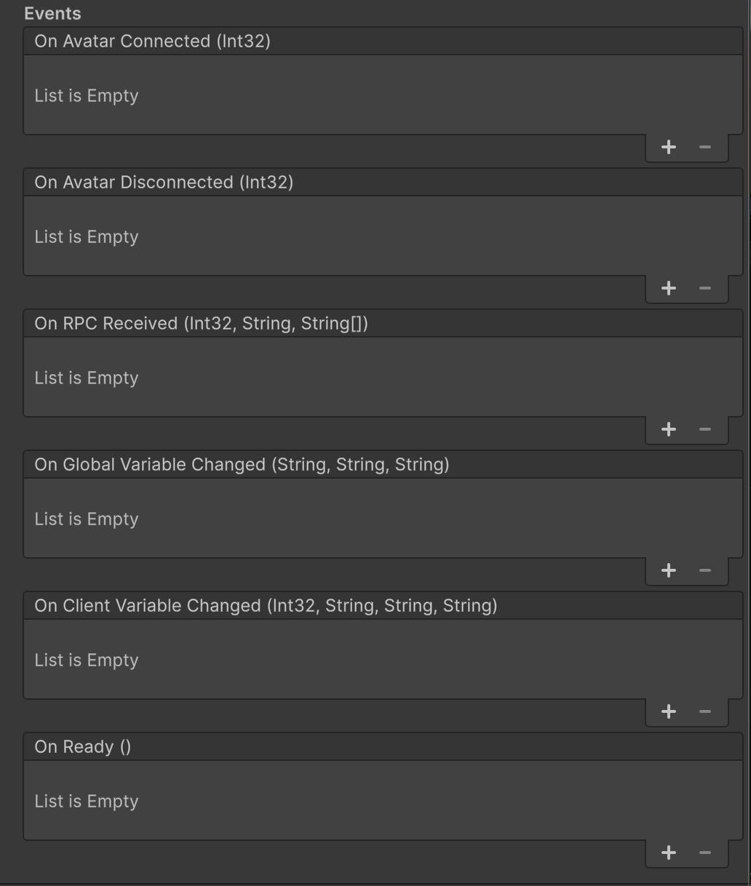

# 🛑このリポジトリはまだ正式に発表されていません🛑
⚠️⚠️隠されたREADMEを発見しました！！⚠️⚠️  
🚫🚫ソーシャルメディアでの投稿はご遠慮ください🚫🚫


# STYLY NetSync for LBE
XRを活用したロケーションベース・エンターテインメント向けのUnityネットワーキングモジュール及びサーバー

[](https://github.com/styly-dev/STYLY-NetSync/releases)
[](https://unity.com/releases/unity-6)
[](https://opensource.org/licenses/Apache-2.0)
[](https://deepwiki.com/styly-dev/STYLY-NetSync) <!-- DeepWiki badge generated by https://deepwiki.ryoppippi.com/ -->


## 概要

ロケーションベース・エンターテインメント（LBE）体験に特化して構築された、Unity向けの最小限で高性能なネットワーキングパッケージです。
STYLY NetSyncには、統合しやすいUnityパッケージと軽量なPythonサーバーが含まれており、会場ネットワークでリアルタイム同期XRセッションを簡単に構築・デプロイできます。

**ハイライト**

- **非常に使いやすい** — シンプルなAPIとドロップイン型パッケージにより、最小限のセットアップで高速統合と実行が可能です。
- **非常に軽量** — 低CPU・メモリフットプリント、ローカルネットワークでの安定したパフォーマンスを実現するために最適化されたネットワークトラフィック。
- **LBEに最適化** — 仮想・物理トランスフォームの同期とヒューマンプレゼンス（衝突回避）を提供します。

## 機能

### メイン機能
- アバタートランスフォーム同期
- RPC（リモートプロシージャコール）
- ネットワーク変数

### その他の機能
- HMDのワンクリックSDKセットアップ
- 多機能XRリグ
- バッテリーレベル管理

一部の機能は依存パッケージであるSTYLY XR Rigを通じて提供されます。

## インストール

### 前提条件

uv/uvx：サーバー起動に必要。  
OpenUPM：Unityプロジェクトにパッケージを追加する場合のみ必要。  

```shell
# Windows
winget install -e --id OpenJS.NodeJS.LTS
winget install --id=astral-sh.uv  -e
npm install -g openupm-cli

# Mac
brew install node
brew install uv
npm install -g openupm-cli
```

### UnityプロジェクトにSTYLY-NetSyncを追加

```shell
# Unityプロジェクトディレクトリに移動
cd YOUR_UNITY_PROJECT_DIR

# 特定のバージョンでNetSyncパッケージを追加
openupm add -f com.styly.styly-netsync@0.5.8
```

## セットアップ

### NetSyncサーバーを起動


```shell
# NetSyncサーバーを起動
# Unityパッケージと同じバージョンを使用
uvx styly-netsync-server@0.5.8
```
uvxコマンドは自動的にパッケージをダウンロードし、分離された仮想環境を作成し、依存関係をインストールし、pythonサーバープログラムを実行します。


### Unityシーンのセットアップ

| HMD用SDKセットアップ | STYLY XR Rig |
|---|---|
| <br>SDKのダウンロード・インストール及び設定を行います。詳細は[こちら](https://github.com/styly-dev/STYLY-XR-Rig/blob/develop/Packages/com.styly.styly-xr-rig/Editor/SetupSDK/README.md)。 | <br>XR Interaction Toolkitのほとんどのサンプル、HMDのMRモード、Unity EditorモードでのWASD制御、HMDコントローラーでのスティック移動をサポートします。  |


#### NetSync Manager

<table>
  <thead>
    <tr>
      <th align="left">インスペクター</th>
      <th align="left">説明</th>
    </tr>
  </thead>
  <tbody>
    <tr>
      <td align="left" valign="top">
        
      </td>
      <td align="left" valign="top">

**プロパティ**
- _deviceId - このクライアントに割り当てられた固有のデバイスIDを表示します。
- _clientNo - サーバーによって割り当てられた数値クライアント番号を表示します。
- _serverAddress - サーバーIPまたはホスト名。空にするとローカルネットワークで自動検出します。
- _roomId - 参加する現在の部屋の識別子。
- _localAvatarPrefab - ローカルユーザーのアバターに使用されるプレハブ。
- _remoteAvatarPrefab - リモートユーザーのアバターに使用されるプレハブ。
- _humanPresencePrefab - 各リモートユーザーの物理的位置に表示されるプレハブ（「ヒューマンプレゼンス」可視化に使用）。
      </td>
    </tr>
    <tr>
      <td align="left" valign="top">
        
      </td>
      <td align="left" valign="top">

**イベント**
- OnAvatarConnected - リモートアバターがネットワークに接続したときにトリガーされ、クライアント番号を引数として渡します。
- OnAvatarDisconnected - リモートアバターがネットワークから切断したときにトリガーされ、クライアント番号を引数として渡します。
- OnRPCReceived - 他のクライアントからリモートプロシージャコール（RPC）を受信したときにトリガーされ、送信者のクライアント番号、関数名、引数を渡します。
- OnGlobalVariableChanged - 他のクライアントによってグローバルネットワーク変数が変更されたときにトリガーされ、変数名、旧値、新値を渡します。
- OnClientVariableChanged - 他のクライアントによってクライアント固有のネットワーク変数が変更されたときにトリガーされ、対象クライアント番号、変数名、旧値、新値を渡します。
- OnReady - NetSyncManagerが完全に準備され、サーバーに接続し、ハンドシェイクが完了してネットワーク変数が同期されたときにトリガーされます。
      </td>
    </tr>
  </tbody>
</table>


## Unity C# API リファレンス

### 名前空間のインポート
```csharp
// STYLY NetSyncをインポート
using Styly.NetSync;
```


### RPC
```csharp
// ルーム内の全クライアントにブロードキャスト
NetSyncManager.Instance.Rpc("FunctionName", new string[] { "arg1", "arg2" });

// RPCの受信
NetSyncManager.Instance.OnRPCReceived.AddListener((senderClientNo, functionName, args) =>
{
    Debug.Log($"RPC(senderClientNo): {senderClientNo}");
    Debug.Log($"RPC(functionName): {functionName}");
    foreach (var arg in args) Debug.Log($"RPC(args): {arg}");
});
```

### ネットワーク変数
```csharp
// グローバル変数の設定（ルーム内の全クライアントで共有）
NetSyncManager.Instance.SetGlobalVariable("gameState", "playing");

// クライアント固有変数の設定（自分自身の設定）
NetSyncManager.Instance.SetClientVariable("playerScore", "100");

// 他のクライアントの変数の設定（そのクライアント番号が必要）
NetSyncManager.Instance.SetClientVariable(targetClientNo, "health", "50");

// 変数の取得
string gameState = NetSyncManager.Instance.GetGlobalVariable("gameState");
string score = NetSyncManager.Instance.GetClientVariable(clientNo, "playerScore");

// デフォルト値を指定した変数の取得
string gameState = NetSyncManager.Instance.GetGlobalVariable("gameState", "Initial State");

// 値の変更をリッスン
NetSyncManager.Instance.OnGlobalVariableChanged.AddListener((name, oldVal, newVal) => {
    Debug.Log($"Global var {name} changed: {oldVal} -> {newVal}");
});

NetSyncManager.Instance.OnClientVariableChanged.AddListener((clientNo, name, oldVal, newVal) => {
    Debug.Log($"Client {clientNo} var {name} changed: {oldVal} -> {newVal}");
});

```


## トランスポート層
STYLY NetSyncは[ZeroMQ](https://zeromq.org/)をトランスポート層として使用します  
– C# (Unity): [NetMQ](https://github.com/zeromq/netmq)  
– Python (server): [pyzmq](https://github.com/zeromq/pyzmq)  

## ライセンス
このリポジトリには複数のサブプロジェクトが含まれており、それぞれが独自のライセンスファイルを持っています。全てのサブプロジェクトはApache License, Version 2.0の下でライセンスされています。